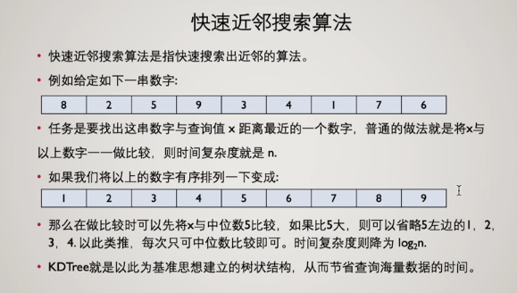

## 准备

1. git、anaconda 下载安装
2. conda 创建虚拟环境或使用 base 环境，python>=3.6(我的是 3.10)
3. 下载安装 pyqt6

## 爬取短视频标题文本

得到 csv 文件，内容为

| vid | title         |
| --- | ------------- |
| 0   | 视频标题 xxxx |

加入了反爬机制: 随机生成随眠时间(虽然只爬首页可能没有也一样能爬())

## 搭建项目开发框架

1. 下载`PyQt6-Fluent-Widgets`轻量版: `pip install PyQt6-Fluent-Widgets -i https://pypi.org/simple/`

   - 查看 ui 效果`git clone -b PyQt6 git@github.com:zhiyiYo/PyQt-Fluent-Widgets.git`，`cd examples/gallery`, `python demo.py`

2. `designer`中做出界面，使用刚才下载的组件库
   - 做出窗口自适应
     1. 使用菜单栏的顶级布局
     2. `widget`的`sizepolicy`属性改为`expending`

## 注意事项

- textedit`setMarkdown()`写入 markdown，换行使用`\n\n`，不能用`\n`,`</br>`

## bug 困扰

- [x] python 文件中使用相对路径错误:

  - `print(os.getcwd())`发现是项目根目录`E:\project\rec\work_together`
  - 相对路径是相对于运行该程序的目录的，我在项目根目录下运行了该文件
  - https://www.zhihu.com/question/466490632
  - 获取项目根目录：`project_dir=os.path.dirname(sys.argv[0])`

- [x] CF_user 推荐的结果 vid 值较小，范围几乎在(0,300)，但视频总数有 12k 多个
  - 评分过于粗糙

## 后续工作

- [x] github 协作，写 ignore
- [x] 协同过滤算法
- [x] 使用 dotenv 文件管理环境变量 -> os 模块管理
- [ ] MF 算法的应用和 cache 存储
- [ ] 基于内容的推荐算法
- [ ] 时间序列预测算法

## 写文档

- 在项目根目录执行`tree /F`即可生成文件树，注意不是`tree -F`

## 评分算法

短视频推荐系统
https://zhuanlan.zhihu.com/p/665398874
影响某个用户观看行为的因素：

1. 用户
   1. 社会属性：性别、年龄、人生阶段、家庭收入、工作状态
   2. 兴趣爱好：游戏、军事、生活...
   3. 好看行为：追某剧、专门看某个人发的视频
2. 内容
   1. 视频固有属性：分类、标签、清晰度、时长
   2. 视频后验信号：点击率、播放完成率、互动率、负反馈率
   3. 作者信息：作者等级、是否原创
3. 环境
   1. 地域：城市/街道/公司/学校
   2. 日期：节假日、时间点、天气
   3. 网络环境

短视频用户对视频的评分
使用"虚拟评分"来代替用户真实的评分，与用户观看该视频的时长、用户是否点赞、点踩、是否评论等用户的行为有关

## 推荐算法

1. 基于内容的推荐 -> 标签
2.

## 想法

1. 数据可视化：视频类
2.

## 召回层做法

1. 通过逻辑筛选：兴趣标签
2. 协同过滤+快速近邻搜索算法
   协同过滤：相似用户/被同样用户喜欢的物品协同过滤出候选物品
3. Embedding+快速近邻搜索算法
   Embedding：通过各种 embedding 手段得到的向量，如 word2vec, graph embedding, bert
   快速近邻搜索算法：KDTree, min-hash, LSH

### 快速近邻搜索算法

#### KDTree



#### LSH 与 MIN-HASH

sh 全称是 Locality Sensitive Hashing（局部敏感哈希）。利用 And then Or 操作使查准的概率增大，误判的概率降低。

Min-hash:属于 lsh 的一种，当两个向量能求 Jaccard 相似度时可用此方法。Jaccard 相似度=交集/并集。

置换操作

```python
def doSig(inputMatrix):
   seqSet = [i for i in range(inputMatrix.shape[0])]
   result = [-1 for i in range(inputMatrix.shape[1])]
   count =0 #初始化count

   while len(seqSet)>0:
      randomSeq = random.choice(seqSet) #随机选一个序号
      for i in range(inputMatrix.shape[1]):
         if inputMatrix[randomSeq][i] == 1 and result[i] == -1:
            result[i] = randomSeq
            count += 1
      if count == inputMatrix.shape[1]:
         break
      seqSet.remove(randomSeq)
   return result
```

## 基于内容的推荐

计算物品最相似的其它物品列表，直接用于 I2I 相似推荐，或者 U2I2I 扩展推荐

1. 内容获取：标题、类别
2. 中文分词-提取关键字，工具：jieba 分词
3. Word2Vec：Spark word2vec, 腾讯 word2vec
4. Doc2Vec：平均、加权平均
5. top-n 相似近邻搜索：scipy 余弦相似度、LSH 局部敏感哈希
6. 缓存

# 时序预测

实现原理：传统统计学，机器学习（非深度学习、深度学习）
预测步长：多步预测
输入变量：自回归预测（输入变量维度只有时间和一维数据）
输出结果：点预测（概率预测？）
目标个数：一元时间序列预测

## 传统时间序列预测方法

### 1. ARIMA

自回归综合移动平均 Auto-Regressive Integrated Moving Averages

建立在此假设基础上：时间序列是平稳的

平稳：时间序列均值没有系统的变化（无趋势）、方差没有系统变化，且严格消除了周期性变化

通过对数变化或差分可以使序列平稳

### 2. Holt-Winters

一种(三次)指数平滑方法

Holt-Winters 季节性方法包括预测方程和三个平滑方程：一个用于水平 ，一个用于趋势 ，另一个用于季节性分量。然后以累加或累乘的方式叠加分量组成预测

### 3. Facebook Prophet

基于时间序列分解和机器学习的拟合来做的

适用于具有强烈季节性影响和多个季节历史数据的时间序列
